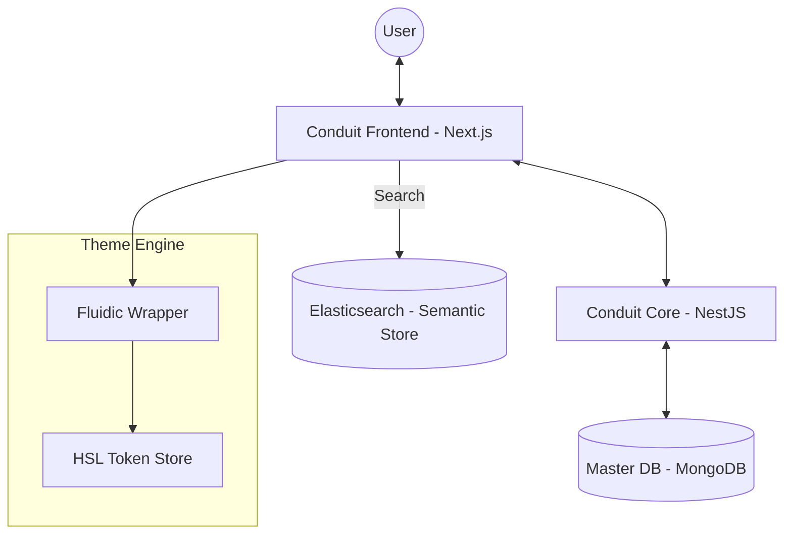

# Frontend Architecture — Conduit

## 1. System Philosophy: Fluidic UI
Conduit's frontend is a polymorphic platform built on the **Fluidic UI** design system. It is designed to handle thousands of unique "creator states"—where typography, color theory, and layout density shift in real-time based on the tenant's identity.

---

## 2. Core Frontend Architecture

### 2.1 Component Interaction Model
The frontend acts as the primary orchestrator between the user, the multi-tenant core, and shared intelligence services (Semantic Search, LLMs).

### 2.2 Subdomain-Driven Resolution
Next.js Edge Middleware intercepts inbound requests to map subdomains to tenant contexts.
- **Workflow**: `alice.octanebrew.dev` → Middleware → Rewrite to `/[tenant]/...` → Page Server Component.
- **Shared Architecture**: While the backend handles data isolation, the frontend handles **Visual Isolation**, ensuring that "Alice's Blog" never leaks the "System Noir" theme to a visitor expecting the "Journal" aesthetic.

---

## 3. High-Performance Front-end Strategy

| Capability | Implementation | Purpose |
| :--- | :--- | :--- |
| **Rendering** | ISR (Incremental Static Regeneration) | Sub-second load times for public articles with background revalidation. |
| **State Sync** | React Query | Optimistic updates for social interactions (likes, saves) and infinite feed loading. |
| **Animation** | Framer Motion | Smooth layout reflowing during theme transitions and "Void Mode" activation. |
| **Search** | Semantic Predictive UI | Real-time interface to the Elasticsearch vector store. |

---

## 4. Complex Feature Subsystems

### 4.1 Fluidic Theme Engine
A high-precision CSS Variable interpolation system. It manages global HSL tokens and layout density reflowing across 10+ distinct aesthetic states (Terminal, Ronin, Cyber, etc.).

### 4.2 Professional Studio Editor
A custom workspace built on Tiptap that provides high-density analytics and a monospaced "Focused" writing environment for creators.
