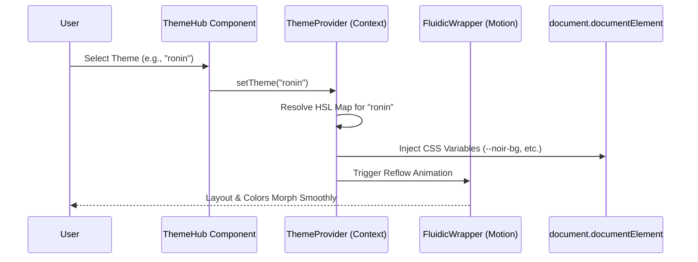
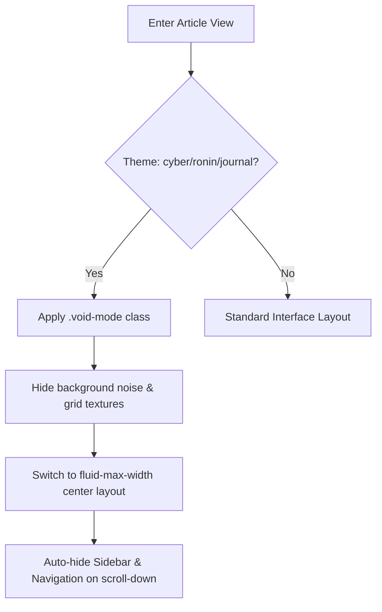
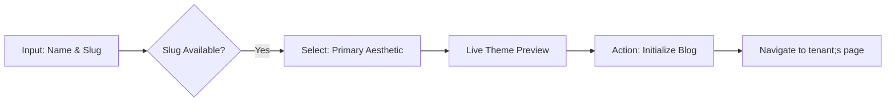

# Frontend User Flows — Conduit

This document details the primary user journeys and interactive states within the Conduit Frontend platform.

---

## 1. Aesthetic Morphing (Theme Transition)
The "Fluidic UI" allows users to transition between diverse visual identities in real-time. This flow describes the client-side state change and CSS variable interpolation.

---

## 2. Immersive Reading (Void Mode Activation)
Void Mode is an aesthetic focal state that strips away UI "noise" (grids, grain, sidebars) to center the reader on the typography.

---

## 3. High-Density Editor Workflow (Studio)
The journey of creating content in the Studio Editor.

1.  **Entry**: User navigates to `/studio/editor`.
2.  **State Restore**: `useDraft` hook checks `localStorage` for unsaved changes.
3.  **Interaction**:
    - User types; `TiptapEditor` emits `onUpdate`.
    - Bubble Menu appears on selection for formatting.
    - Media Manager opens a side-sheet for Unsplash integration.
4.  **Completion**: User clicks "Publish". Frontend sends request to Core API and redirects to the new live URL.

---

## 4. Multi-Step Onboarding (Blog Genesis)
A guided wizard for new creators.

---

## 5. Semantic Search Interaction
Predictive UX for global and tenant-specific discovery.

1.  **Input**: User focuses the search bar (`/` key shortcut).
2.  **Type-ahead**: On change, hit the `Search` module; returns semantic "Key Concepts".
3.  **Suggestion**: Display type-ahead suggestions with highlighted concept matches.
4.  **Execution**: User presses Enter; route transitions to `/search?q=...` or `/[tenant]/search?q=...`.
