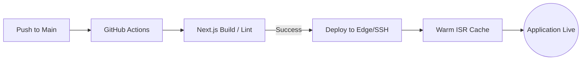

# Infrastructure & Operations (Frontend) — Conduit

## 1. Frontend Build & Deployment Pipeline

Conduit Frontend utilizes a Next.js optimized pipeline for high-performance edge delivery.

---

## 2. Infrastructure Stack

| Component | Technology | Role |
| :--- | :--- | :--- |
| **Framework** | Next.js 16 (App Router) | React framework and Edge runtime. |
| **Styling Engine** | Tailwind CSS v4 | Build-time CSS optimization. |
| **PWA Layer** | Serwist / Service Workers | Offline reading and asset caching. |
| **Analytics** | Custom Dashboard | Creator engagement tracking. |
| **Reverse Proxy** | Nginx | Subdomain routing and SSL termination. |

---

## 3. High-Scale Deployment Strategy

### 3.1 Edge Middleware Resolution
The infrastructure is designed to resolve tenant contexts at the network edge, minimizing the round-trip to the origin server. This allows Conduit to scale to 10,000+ blogs with consistent latency.

### 3.2 Offline First (PWA)
By implementing Service Workers, the frontend can cache:
- **Core Assets**: JS, CSS, and Theme textures.
- **Reading Lists**: Articles saved by readers for offline consumption.
- **Theme States**: Ensuring that the visitor's preferred aesthetic is preserved even on poor connections.

---

## 4. Monitoring & performance
- **Bundle Analysis**: Automated checks for JS bloat to maintain sub-100kb shared runtime.
